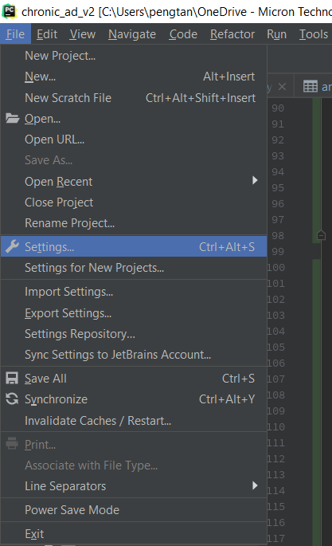
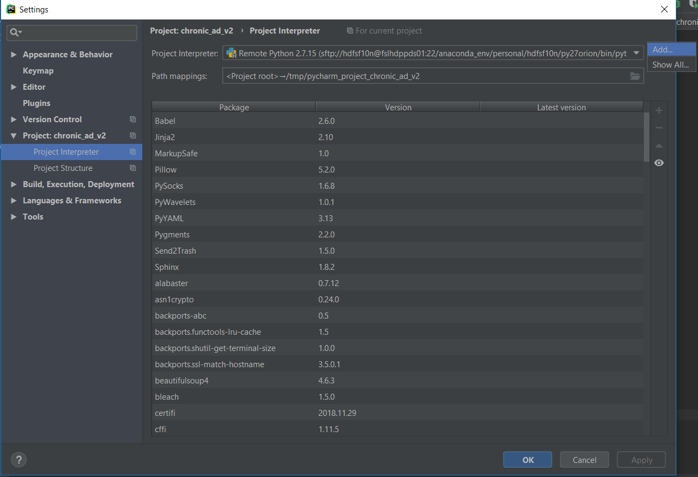

# This chapter we will create a example project in PyCharm

## Sample Folder Structure

```bash
project_root/
	--- conf/
    --- src/
        --- __init__.py
    --- logs/
    --- data/
    --- sql/
    --- scripts/
    --- test/
    .gitignore
    README.md

```


## Setup interpreter

In PyCharm, open PyCharm settings. Then choose or add the Python interpreter. 





## Enable version control


## Create .gitignore File

## Python Module

