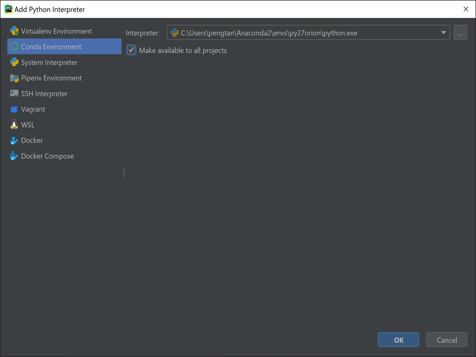

# This chapter we will create a example project in PyCharm

- By default, we use __community version__ for demo. 
We will illustrate the difference between community version and professional
version. 

## Create a project    
   
Create a new project from PyCharm   


Name your project and choose a Python Interpreter


Choose a Python Interpreter.
- Suggest to use conda environment 



## Sample Folder Structure
By default, this will create a empty project `project_root`. 

In order to complete the preparation, we need to follow steps:
1. Based on your project needs, initiate your folder structure. 
2. Enable your version control and add .gitignore file
3. Add README.md
4. Create a repo in the remote server (github/bitbucket, etc) 
and add this repo as remote

```bash
project_root/

    --- conf/
    --- src/
        --- __init__.py
    --- logs/
    --- data/
    --- sql/
    --- scripts/
    --- test/
    .gitignore
    README.md
```

- `conf`: this folder is to store the configuration files for this project. Based on current experience, yaml is 
easy-to-use format and easy-to-read format
- `src`: this folder is store the project code. Remember to add `__init__.py` in the folder to 
make this as a module
- `logs`: this folder is to store the log file. Remember to put this as git ignore.
- `data`: this folder is to store sample file.
- `sql`: this folder is to store sample query file. `hql` for hive query. `sql` for sql query and `tql` for 
Teradata query.
- `script`: this folder is to store sample script such as scripts to do the log clean and database clean.
- `test`: this folder is to store test code. 
- `.gitignore`: configuration file for git ignore. Suggest to use `.ignore` plugin to generate this file.
- `README.md`: the markdown file to introduce the repo.
    1. This should include the project purpose.
    2. suggest to include the entry point for code.
    3. Better to include some sample test case or test code.
    4. include wiki page or project documentation page link.


If some of components are missing, below points are used to change the settings in project

## Setup interpreter

In PyCharm, open PyCharm settings. Then choose or add the Python interpreter. 


## Enable version control
In the menu, under the tab VCS and choose the enable the version control 
and then choose the method you plan to use, git etc..


## Create .gitignore File
Use .ignore plug-in and generate .gitignore template.

## Python Module

In python, a `__init__.py` file is a indicator of a python module.