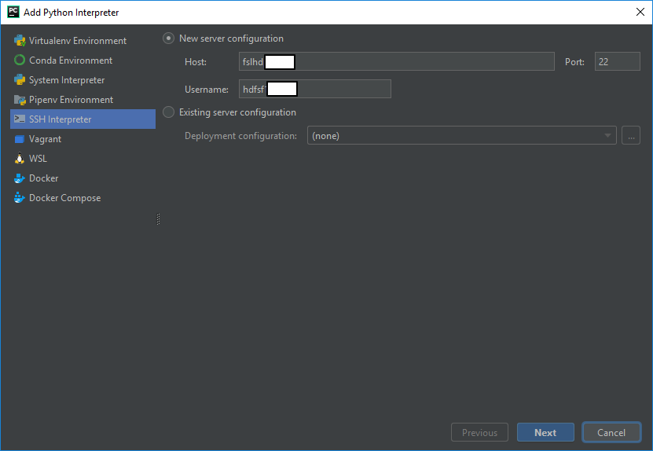

# Professional version

If you have a student email account from NUS/NTU/..., you can apply this profession license from JetBrain. 

[Apply Student Professional Version](https://www.jetbrains.com/student/)

### Add Remote Interpreter
1. Add Interpreter

2. Add server config and password

3. Add Python Path and File Mapping

### Add Run Configuration

### Deploy (Upload)

### Run 

