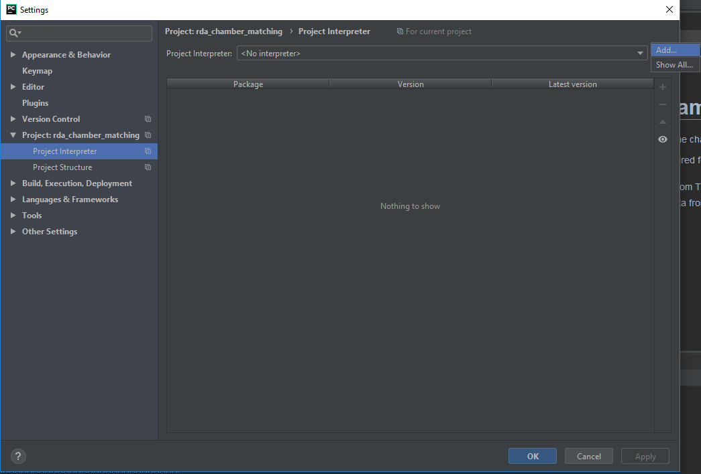
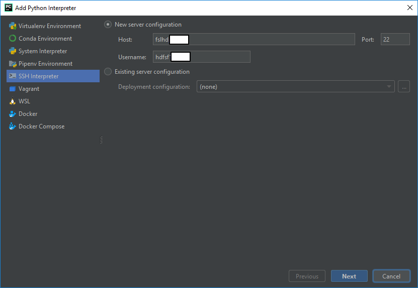
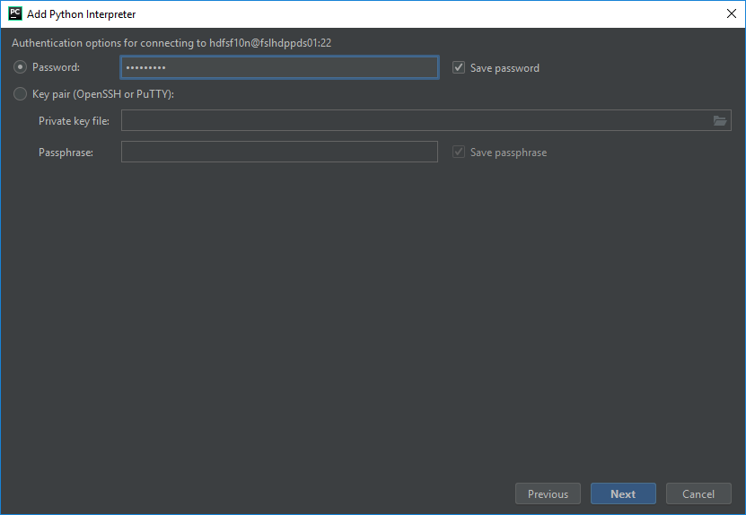
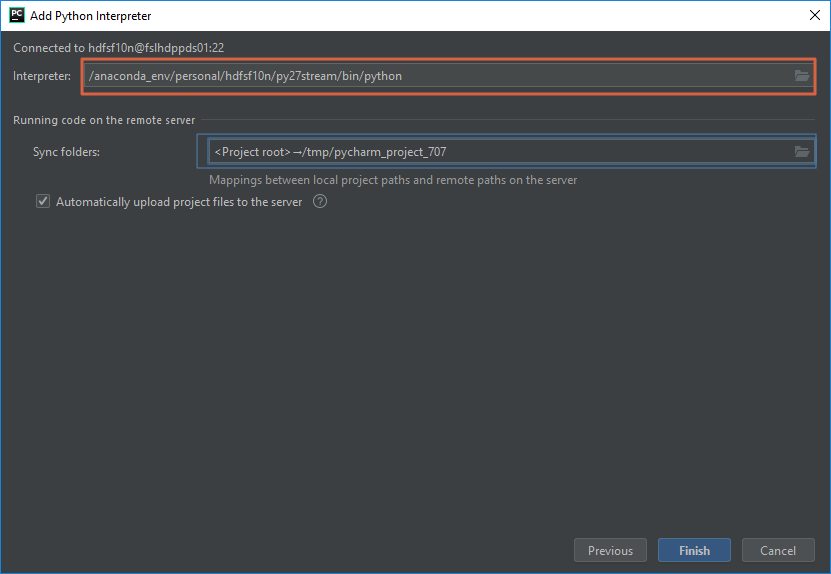
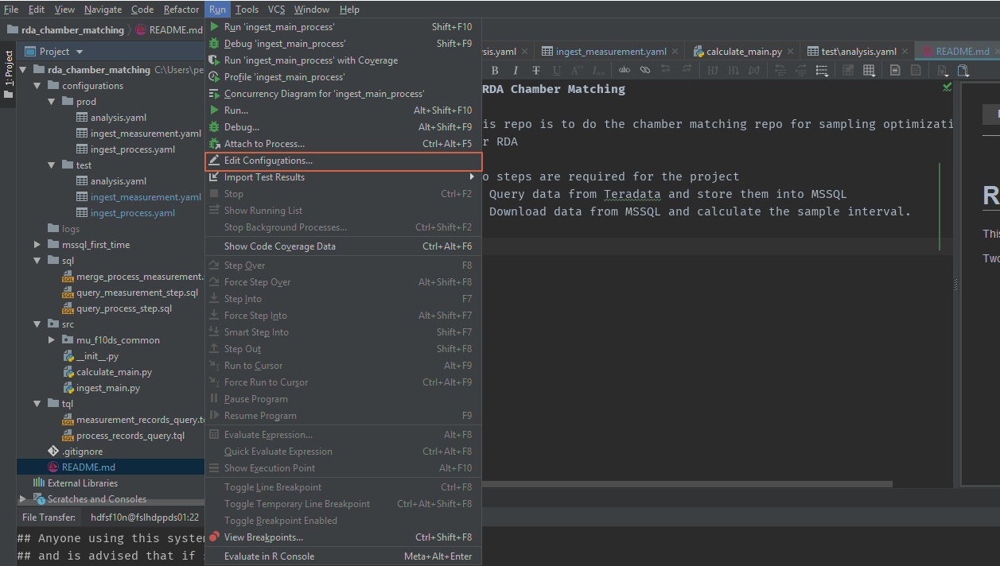
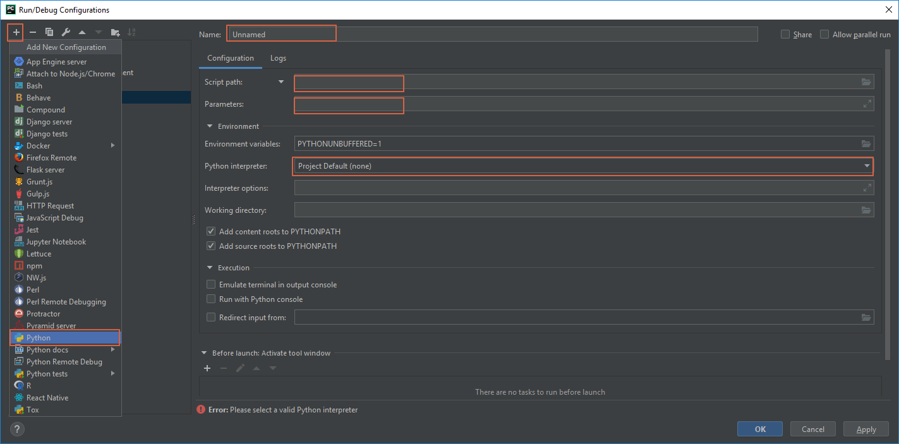
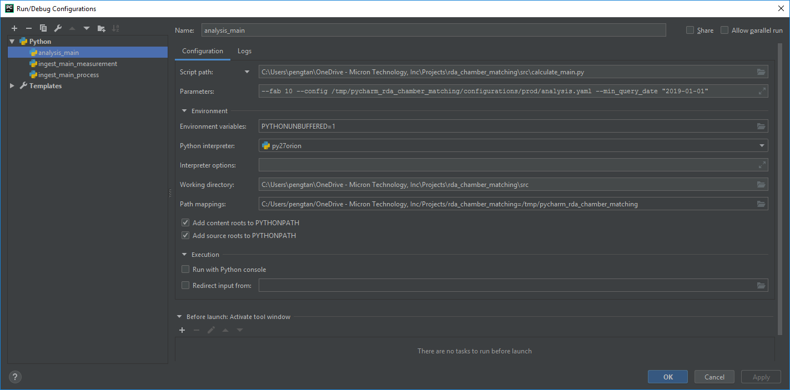
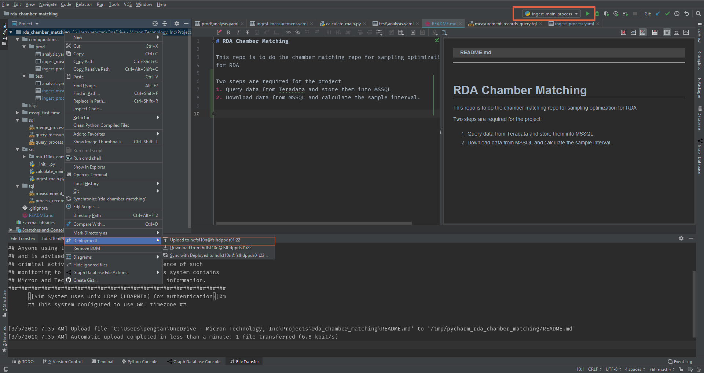

# Professional version

If you have a student email account from NUS/NTU/..., you can apply this profession license from JetBrain. 

[Apply Student Professional Version](https://www.jetbrains.com/student/)

### Add Remote Interpreter
1. Add Interpreter

2. Add server config and password

3. Add Python Path and File Mapping

### Add Run Configuration
1. Add Run Config

- Name this config meaningfully. It will help to locate the configuration once you have multiple configuration together.
- Add Python Script and paramters (if your script has input parameter)
- Choose correct interpreter

### Deploy (Upload) and Run

